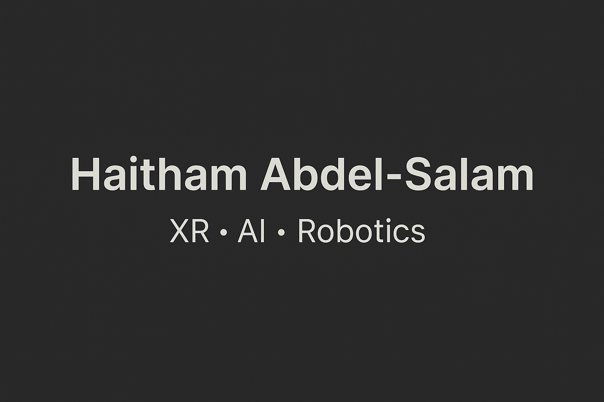

<!---->
## Hi there 👋

# 👋 Hi, I'm Haitham Abdel-Salam

I'm a **Unity/XR Engineer** with 10+ years of experience building immersive interactive systems. Currently transitioning into **AI, robotics, and embedded systems**, I blend deep creative tech expertise with emerging machine learning and real-time control technologies.

---

## 🚀 What I Do

- 🎮 Build XR and interactive experiences using **Unity**, **C#**, **MQTT**, and custom toolchains  
- 🤖 Explore **robotics** and **real-time systems** (MQTT, embedded computing)  
- 🧠 Prototype with **ML Agents**, **CNNs**, and **generative AI** for intelligent content  
- 🌐 Collaborate across creative, technical, and scientific domains  
- 🌍 Open to **Collaboration**

---

## 🧠 Selected Projects

### 🟣 [ReinforcementLearningAgent](https://github.com/HaithamHany/ReinforcementLearningAgent)
Unity prototype using ML-Agents to train a reinforcement learning agent in a 3D simulation environment.  
**Tech:** Unity · C# · ML-Agents · Reinforcement Learning · Simulation

---

### 🟢 [SeismicActivityDetection](https://github.com/HaithamHany/SeismicActivityDetection)
Detects seismic events using a CNN trained on spectrograms of time-series data.  
**Tech:** Python · STFT · VGG16 · Signal Processing · TensorFlow

---

### 🔵 [Battle-Simulator-Prototype](https://github.com/HaithamHany/Battle-Simulator-Prototype)
Unity-based AI simulator where autonomous agents compete using finite-state machines.  
**Tech:** Unity · C# · FSM · AI Simulation

---

### 🔶 [Plausibility-Breaking in Unreal](https://github.com/HaithamHany/Plausibility-breaking-in-Unreal-Engine)
VR research prototype inspired by IEEE VR paper, exploring how plausibility can break without ruining user presence.  
**Tech:** Unreal Engine · C++ · VR Design · Research UX

---

### 🟠 [Deep-Learning-Venue-Classifier](https://github.com/HaithamHany/Deep-Learning-Venue-Classifier)
Evaluates CNN and decision trees for venue classification using both supervised and semi-supervised learning.  
**Tech:** Python · CNN · Semi-Supervised Learning · Scikit-learn

---

### 🟠 [vhdl-four-bit-adder-multiregister-system](https://github.com/HaithamHany/vhdl-four-bit-adder-multiregister-system)
A hardware-based 4-bit adder system with multiple registers, debounced button inputs, clock division, and seven-segment display output built using VHDL on the Basys3 FPGA board, with interactive input handling (switches/buttons) and real-time output display (LEDs/seven segment).  
**Tech:** VHDL · FPGA · 

---

## 📚 Currently Learning

- Robotics & Embedded Systems (Certificate, Toronto Metropolitan University)  
- ROS 2 · Microcontrollers · Real-Time Control  
- Reinforcement Learning for Robotics  
- Generative AI workflows (text-to-scene, AI agents)

---

## 🔗 Connect With Me

- 🔗 [LinkedIn](https://www.linkedin.com/in/haithamhany)  
- 📫 haithamhany7@gmail.com  

---

## 💡 Fun Fact

I love science fiction, space systems, and inventing things that make people go: *"Whoa, this is the future."*

